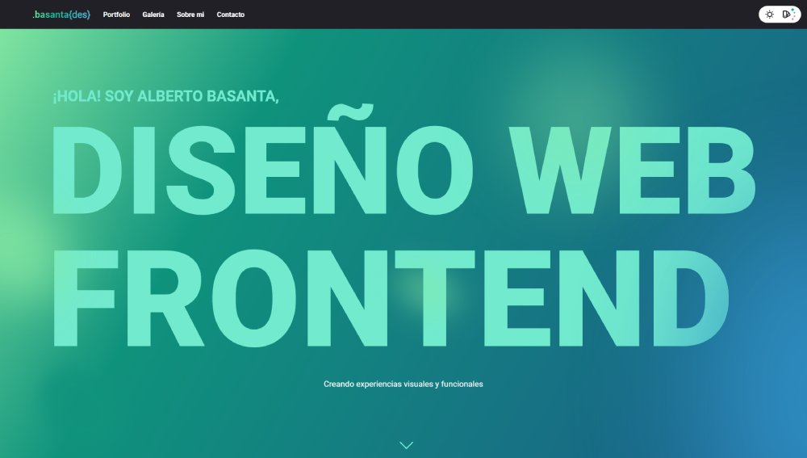

# Portafolio Personal de Alberto Basanta

## Descripción

Bienvenido a mi portafolio personal, donde presento mis habilidades y proyectos en diseño gráfico y desarrollo web. Este sitio web está desarrollado con HTML, CSS y JavaScript puro, ofreciendo una experiencia interactiva y responsiva para los visitantes.

Puedes explorar el portafolio en línea en: [https://basantades.vercel.app/](https://basantades.vercel.app/)

## Navegación

Una vez abierto el `index.html`, podrás navegar por las diferentes secciones de mi portafolio:

- **Inicio:** Presentación y bienvenida.
- **Portfolio:** Galería de proyectos destacados con descripciones y enlaces.
- **Galería:** Muestra de trabajos de diseño gráfico.
- **Sobre mí:** Información personal, habilidades y aficiones.
- **Contacto:** Formulario y enlaces a redes sociales para establecer comunicación.

## Características

- **Modo Claro/Oscuro:** Alterna entre temas claro y oscuro para una mejor experiencia visual.
- **Paletas de Colores Personalizables:** Además del modo claro/oscuro, el sitio ofrece cuatro paletas de colores diferentes que se pueden seleccionar para personalizar la apariencia.
- **Animaciones Interactivas:** Efectos de entrada y desplazamiento para una navegación atractiva.
- **Diseño Responsivo:** Adaptado para una visualización óptima en dispositivos móviles y de escritorio.

## Tecnologías Utilizadas

- **HTML5:** Estructura y contenido del sitio web.
- **CSS3:** Estilos y diseño visual, incluyendo animaciones y transiciones.
- **JavaScript:** Funcionalidades interactivas como el cambio de tema, selección de paletas de colores y animaciones dinámicas.

## Licencia

Este proyecto está bajo la Licencia MIT. Consulta el archivo [LICENSE](LICENSE) para más detalles.

## Contacto

Para consultas o colaboraciones:

- **Correo Electrónico:** [basantades@gmail.com](mailto:basantades@gmail.com)
- **LinkedIn:** [albertobasanta](https://www.linkedin.com/in/albertobasanta/)
- **GitHub:** [basantades](https://github.com/basantades)

---